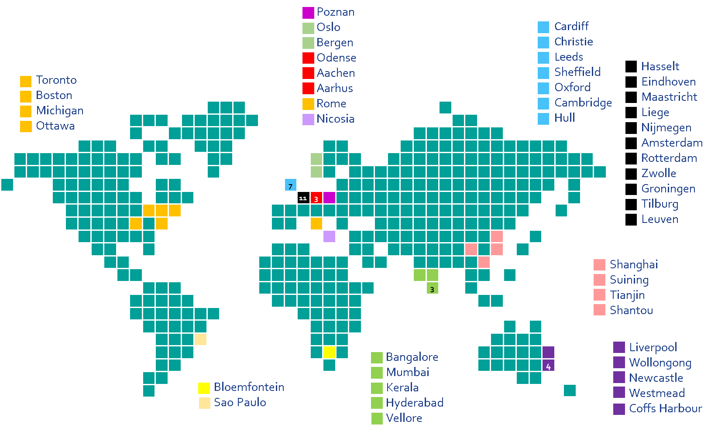

# CORAL: Community in Oncology for RApid Learning

## Introduction

UM/MUMC+/Maastro Clinical Data Science (CDS) did a study in 2018 internally 
called the 20k challenge [1]. In this challenge we successfully applied 
privacy-preserving, federated learning / Personal Health Train principles 
to learn and validate a prediction model for 2 year overall survival for 
lung cancer patients using more than 20.000 patients from 8 sites. 

The CDS vision is to responsibly learn from all data of all people in the world 
to improve health, therefore we would like to continuously extend our 
network of hospitals which share this vision. The current state of the network 
with past, present and prospective partners is shown in the figure below. 

 

To onboard new partners and maintain this network, we need to have an 
easy-to-implement, continuous learning project. The 20k challenge seems a 
good choice for this as it only concerns a limited number of data elements 
which are all often well captured in clinical routine practice.

## Requirements

## Environment variables

## How to run

## References

[1] T. M. Deist et al., “Distributed learning on 20 000+ lung cancer patients – 
The Personal Health Train,” Radiother. Oncol., vol. 144, pp. 189–200, Mar. 2020, 
doi: 10.1016/j.radonc.2019.11.019.